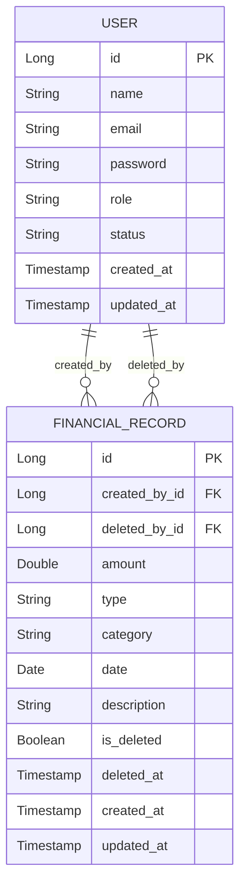

# Finance Data Processing & Access Control Backend

A production-grade RESTful backend system for secure financial record management and role-based user access. The application is built using Spring Boot with JWT authentication and follows clean architecture principles for scalability, maintainability, and real-world usability.

---

## Live Application

Swagger UI:
[https://financeapp-vkrm.onrender.com/swagger-ui/index.html#/](https://financeapp-vkrm.onrender.com/swagger-ui/index.html#/)

---

## Swagger Usage Guide 

To access secured APIs, authentication is required.

### Option 1: Login

POST /api/auth/login

```
email: admin01@gmail.com
password: pass1234
```

### Option 2: Register Admin

POST /api/auth/register

After login or registration:

1. A JWT token will be returned in the response
2. Copy the token
3. Click the **Authorize** button in Swagger (top-right)
4. Paste the token.
5. Click "Authorize"

Now all secured APIs will be accessible.

Note: Without authorization, most APIs will not work due to role-based access control.

---

## Project Overview

This backend system is designed for a finance dashboard where users interact with financial data based on their assigned roles.

The system supports:

* Secure authentication and authorization
* Role-based access control (RBAC)
* Financial record lifecycle management
* Dashboard analytics and insights
* Data validation and error handling

---

## Why Spring Boot and PostgreSQL

### Spring Boot

* Rapid backend development with minimal configuration
* Built-in support for REST APIs, dependency injection, and validation
* Seamless integration with Spring Security for authentication and authorization
* Widely used in enterprise-grade backend systems

### PostgreSQL

* Strong ACID compliance ensures financial data integrity
* Efficient handling of complex queries and aggregations
* Ideal for analytical operations such as trends and summaries
* Reliable and scalable for production deployments

---

## Technology Stack

| Layer         | Technology                |
| ------------- | ------------------------- |
| Language      | Java 17                   |
| Framework     | Spring Boot 3             |
| Security      | Spring Security + JWT     |
| Database      | PostgreSQL                |
| ORM           | Spring Data JPA           |
| Build Tool    | Maven                     |
| Documentation | Swagger (OpenAPI)         |
| Testing       | JUnit 5, Mockito, MockMvc |
| Deployment    | Render                    |

---

## Architecture & Design

Layered Architecture:

Client → Controller → Service → Repository → Database

Key Principles:

* Separation of concerns
* DTO-based communication
* Stateless authentication using JWT
* Role-based authorization using annotations
* Centralized exception handling
* Clean and modular structure

---


## Local Setup Guide

Follow these steps to run the application locally.

---

### Prerequisites

Ensure the following are installed:

* Java 17 or higher
* Maven
* PostgreSQL
* Git

---

### Step 1: Clone the Repository

```bash
git clone <repository-url>
cd financeapp
```

---

### Step 2: Configure PostgreSQL Database

Create a database:

```sql
CREATE DATABASE financeapp;
```

Update your `application.properties` (or `application.yml`):

```properties
spring.datasource.url=jdbc:postgresql://localhost:5432/financeapp
spring.datasource.username=postgres
spring.datasource.password=your_password

spring.jpa.hibernate.ddl-auto=update
spring.jpa.show-sql=true
```

---

### Step 3: Build the Project

```bash
mvn clean install
```

---

### Step 4: Run the Application

```bash
mvn spring-boot:run
```

Application will start on:

```
http://localhost:8080
```

---

### Step 5: Access Swagger UI

```
http://localhost:8080/swagger-ui/index.html
```

---

## Functional Features

### Authentication & Authorization

* JWT-based authentication
* Stateless session management
* Secure password hashing using BCrypt
* Role-based endpoint protection

### User Management

* Create users (Admin only)
* Assign roles (ADMIN, ANALYST, VIEWER)
* Activate or deactivate users
* Fetch users with role-based restrictions

### Financial Records Management

* Create, update, delete financial records
* Bulk record creation support
* Soft delete and restore functionality
* Filtering by date, category, and type
* Pagination and sorting support

### Dashboard & Analytics

* Total income and expense calculation
* Net balance computation
* Monthly and weekly trends
* Category-wise aggregation
* Recent transactions
* Month-to-month comparison

### Access Control

* Strict enforcement of role-based permissions
* Viewer: Read-only access
* Analyst: Read + analytics
* Admin: Full access

### Validation & Error Handling

* Input validation using annotations
* Standardized API error responses
* Global exception handling
* Proper HTTP status usage

---

## API Overview

### Authentication

- POST /api/auth/register
- POST /api/auth/login

---

### User Management

= POST /api/users
- GET /api/users
- GET /api/users/{id}
- PUT /api/users/{id}/role
- PATCH /api/users/{id}/status

---

### Financial Records

- POST /api/records
- POST /api/records/bulk
- GET /api/records
- GET /api/records/{id}
- PUT /api/records/{id}
- DELETE /api/records/{id}
- PATCH /api/records/{id}/restore

Advanced:

- GET /api/records/filter
- GET /api/records/deleted

Features:

* Pagination supported
* Sorting supported
* Filtering supported

---

### Dashboard APIs

- GET /api/dashboard/summary
- GET /api/dashboard/trends
- GET /api/dashboard/trends/weekly
- GET /api/dashboard/recent
- GET /api/dashboard/comparison
- GET /api/dashboard/category-summary

---

## Database Design

Entity Relationship Diagram (ERD)


---

## Testing Strategy

### Test Summary

| Test Type         | Count |
| ----------------- | ----- |
| Unit Tests        | 18    |
| Integration Tests | 45    |
| Security Tests    | 8     |
| End-to-End Tests  | 3     |
| Total             | 71    |

---

### Testing Breakdown

Unit Testing:

* Service-level validation
* Mocked dependencies
* Tools: Mockito, JUnit 5

Integration Testing:

* Full application context
* API validation using MockMvc

Security Testing:

* JWT validation
* Role-based access verification

End-to-End Testing:

* Complete workflow validation

---

## Deployment

* Deployed on Render cloud platform
* PostgreSQL database integrated
* Live production API available

---

## Key Highlights

* Clean layered architecture
* Production-ready JWT security
* Role-based access control implementation
* Advanced financial analytics APIs
* Pagination, sorting, and filtering
* Soft delete and restore support
* Comprehensive test coverage (71 tests)
* Live deployed backend

---

## Future Enhancements

* Refresh token implementation
* Redis caching
* Rate limiting
* Multi-user financial ownership
* Export reports (PDF/CSV)

---

## Conclusion

This project demonstrates strong backend engineering capabilities, including:

* Secure API design
* Clean and scalable architecture
* Proper data modeling
* Robust access control
* Real-world financial analytics implementation
